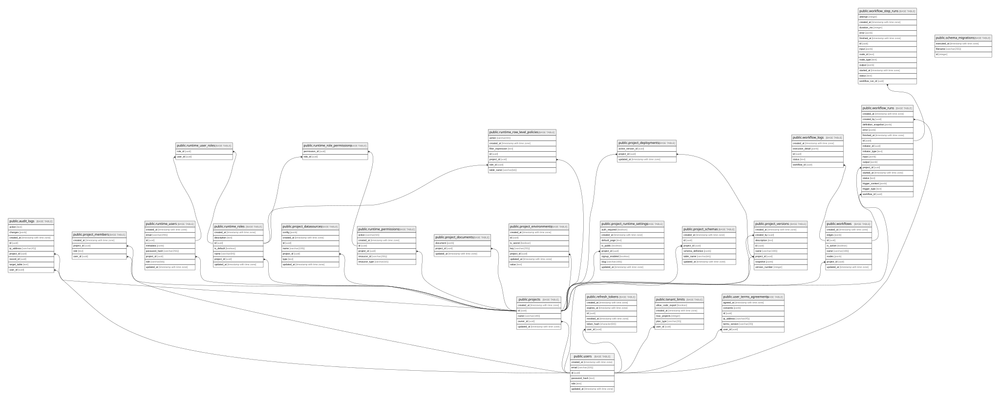

# BakeApp PostgreSQL Schema

## Description

BakeApp Studio의 인증·프로젝트·동적 데이터 스키마

## Tables

| Name                                                                      | Columns | Comment                                                        | Type       |
| ------------------------------------------------------------------------- | ------- | -------------------------------------------------------------- | ---------- |
| [public.audit_logs](public.audit_logs.md)                                 | 9       | API 데이터 변경에 대한 감사 로그                                           | BASE TABLE |
| [public.project_datasources](public.project_datasources.md)               | 7       | 프로젝트별 외부 데이터베이스 연결 설정                                          | BASE TABLE |
| [public.project_deployments](public.project_deployments.md)               | 3       | 프로젝트별 현재 프로덕션 배포 버전                                            | BASE TABLE |
| [public.project_documents](public.project_documents.md)                   | 3       | 프로젝트 편집 상태를 보관하는 JSON 문서                                       | BASE TABLE |
| [public.project_environments](public.project_environments.md)             | 7       | 프로젝트별 환경 변수와 암호화된 Secret 값                                     | BASE TABLE |
| [public.project_members](public.project_members.md)                       | 4       | 프로젝트별 협업 권한                                                    | BASE TABLE |
| [public.project_runtime_settings](public.project_runtime_settings.md)     | 8       | 배포된 프로젝트를 런타임 앱으로 노출하기 위한 슬러그·공개 설정                            | BASE TABLE |
| [public.project_schema_migrations](public.project_schema_migrations.md)   | 7       |                                                                | BASE TABLE |
| [public.project_schemas](public.project_schemas.md)                       | 6       | 프로젝트별 동적 데이터 스키마 정의                                            | BASE TABLE |
| [public.project_versions](public.project_versions.md)                     | 8       | 프로젝트별 릴리즈 버전 스냅샷                                               | BASE TABLE |
| [public.projects](public.projects.md)                                     | 5       | 사용자가 소유하는 앱 빌더 프로젝트                                            | BASE TABLE |
| [public.refresh_tokens](public.refresh_tokens.md)                         | 6       | 해시된 갱신 토큰                                                      | BASE TABLE |
| [public.runtime_permissions](public.runtime_permissions.md)               | 6       |                                                                | BASE TABLE |
| [public.runtime_role_permissions](public.runtime_role_permissions.md)     | 2       |                                                                | BASE TABLE |
| [public.runtime_roles](public.runtime_roles.md)                           | 7       |                                                                | BASE TABLE |
| [public.runtime_row_level_policies](public.runtime_row_level_policies.md) | 7       |                                                                | BASE TABLE |
| [public.runtime_user_roles](public.runtime_user_roles.md)                 | 2       |                                                                | BASE TABLE |
| [public.runtime_users](public.runtime_users.md)                           | 8       | 프로젝트별 런타임(최종 사용자) 계정                                           | BASE TABLE |
| [public.schema_migrations](public.schema_migrations.md)                   | 3       |                                                                | BASE TABLE |
| [public.tenant_limits](public.tenant_limits.md)                           | 5       | 사용자 플랜별 프로젝트 및 내보내기 한도                                         | BASE TABLE |
| [public.user_terms_agreements](public.user_terms_agreements.md)           | 6       | 사용자 약관 및 선택 동의 이력                                              | BASE TABLE |
| [public.users](public.users.md)                                           | 6       | BakeApp 자체 인증 사용자                                              | BASE TABLE |
| [public.workflow_logs](public.workflow_logs.md)                           | 5       | 워크플로우 실행 성공·실패 이력과 노드 실행 결과                                    | BASE TABLE |
| [public.workflow_runs](public.workflow_runs.md)                           | 16      | 워크플로우 실행 단위의 상태·입출력·오류 이력                                      | BASE TABLE |
| [public.workflow_step_runs](public.workflow_step_runs.md)                 | 13      | 워크플로우 실행 단계별 상태·재시도·처리 시간 이력                                   | BASE TABLE |
| [public.workflows](public.workflows.md)                                   | 8       | 프로젝트별 활성 워크플로우 노드 및 엣지 정의                                      | BASE TABLE |

## Stored procedures and functions

| Name                            | ReturnType | Arguments                          | Type     |
| ------------------------------- | ---------- | ---------------------------------- | -------- |
| public.armor                    | text       | bytea                              | FUNCTION |
| public.armor                    | text       | bytea, text[], text[]              | FUNCTION |
| public.crypt                    | text       | text, text                         | FUNCTION |
| public.dearmor                  | bytea      | text                               | FUNCTION |
| public.decrypt                  | bytea      | bytea, bytea, text                 | FUNCTION |
| public.decrypt_iv               | bytea      | bytea, bytea, bytea, text          | FUNCTION |
| public.digest                   | bytea      | bytea, text                        | FUNCTION |
| public.digest                   | bytea      | text, text                         | FUNCTION |
| public.encrypt                  | bytea      | bytea, bytea, text                 | FUNCTION |
| public.encrypt_iv               | bytea      | bytea, bytea, bytea, text          | FUNCTION |
| public.gen_random_bytes         | bytea      | integer                            | FUNCTION |
| public.gen_random_uuid          | uuid       |                                    | FUNCTION |
| public.gen_salt                 | text       | text                               | FUNCTION |
| public.gen_salt                 | text       | text, integer                      | FUNCTION |
| public.hmac                     | bytea      | bytea, bytea, text                 | FUNCTION |
| public.hmac                     | bytea      | text, text, text                   | FUNCTION |
| public.pgp_armor_headers        | record     | text, OUT key text, OUT value text | FUNCTION |
| public.pgp_key_id               | text       | bytea                              | FUNCTION |
| public.pgp_pub_decrypt          | text       | bytea, bytea                       | FUNCTION |
| public.pgp_pub_decrypt          | text       | bytea, bytea, text                 | FUNCTION |
| public.pgp_pub_decrypt          | text       | bytea, bytea, text, text           | FUNCTION |
| public.pgp_pub_decrypt_bytea    | bytea      | bytea, bytea                       | FUNCTION |
| public.pgp_pub_decrypt_bytea    | bytea      | bytea, bytea, text                 | FUNCTION |
| public.pgp_pub_decrypt_bytea    | bytea      | bytea, bytea, text, text           | FUNCTION |
| public.pgp_pub_encrypt          | bytea      | text, bytea                        | FUNCTION |
| public.pgp_pub_encrypt          | bytea      | text, bytea, text                  | FUNCTION |
| public.pgp_pub_encrypt_bytea    | bytea      | bytea, bytea                       | FUNCTION |
| public.pgp_pub_encrypt_bytea    | bytea      | bytea, bytea, text                 | FUNCTION |
| public.pgp_sym_decrypt          | text       | bytea, text                        | FUNCTION |
| public.pgp_sym_decrypt          | text       | bytea, text, text                  | FUNCTION |
| public.pgp_sym_decrypt_bytea    | bytea      | bytea, text                        | FUNCTION |
| public.pgp_sym_decrypt_bytea    | bytea      | bytea, text, text                  | FUNCTION |
| public.pgp_sym_encrypt          | bytea      | text, text                         | FUNCTION |
| public.pgp_sym_encrypt          | bytea      | text, text, text                   | FUNCTION |
| public.pgp_sym_encrypt_bytea    | bytea      | bytea, text                        | FUNCTION |
| public.pgp_sym_encrypt_bytea    | bytea      | bytea, text, text                  | FUNCTION |
| public.update_updated_at_column | trigger    |                                    | FUNCTION |

## Relations

---

> Generated by [tbls](https://github.com/k1LoW/tbls)
