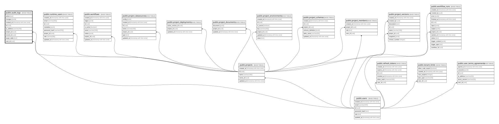

# public.audit_logs

## Description

API 데이터 변경에 대한 감사 로그

## Columns

| Name         | Type                     | Default           | Nullable | Children | Parents                               | Comment |
| ------------ | ------------------------ | ----------------- | -------- | -------- | ------------------------------------- | ------- |
| action       | text                     |                   | false    |          |                                       |         |
| changes      | jsonb                    |                   | true     |          |                                       |         |
| created_at   | timestamp with time zone | CURRENT_TIMESTAMP | false    |          |                                       |         |
| id           | uuid                     | gen_random_uuid() | false    |          |                                       |         |
| ip_address   | varchar(45)              |                   | true     |          |                                       |         |
| project_id   | uuid                     |                   | true     |          | [public.projects](public.projects.md) |         |
| record_id    | uuid                     |                   | true     |          |                                       |         |
| target_table | text                     |                   | true     |          |                                       |         |
| user_id      | uuid                     |                   | true     |          | [public.users](public.users.md)       |         |

## Constraints

| Name                       | Type        | Definition                                                          |
| -------------------------- | ----------- | ------------------------------------------------------------------- |
| audit_logs_pkey            | PRIMARY KEY | PRIMARY KEY (id)                                                    |
| audit_logs_project_id_fkey | FOREIGN KEY | FOREIGN KEY (project_id) REFERENCES projects(id) ON DELETE SET NULL |
| audit_logs_user_id_fkey    | FOREIGN KEY | FOREIGN KEY (user_id) REFERENCES users(id) ON DELETE SET NULL       |

## Indexes

| Name                              | Definition                                                                                                    |
| --------------------------------- | ------------------------------------------------------------------------------------------------------------- |
| audit_logs_pkey                   | CREATE UNIQUE INDEX audit_logs_pkey ON public.audit_logs USING btree (id)                                     |
| audit_logs_project_created_at_idx | CREATE INDEX audit_logs_project_created_at_idx ON public.audit_logs USING btree (project_id, created_at DESC) |
| audit_logs_target_record_idx      | CREATE INDEX audit_logs_target_record_idx ON public.audit_logs USING btree (target_table, record_id)          |
| audit_logs_user_created_at_idx    | CREATE INDEX audit_logs_user_created_at_idx ON public.audit_logs USING btree (user_id, created_at DESC)       |

## Relations

---

> Generated by [tbls](https://github.com/k1LoW/tbls)
