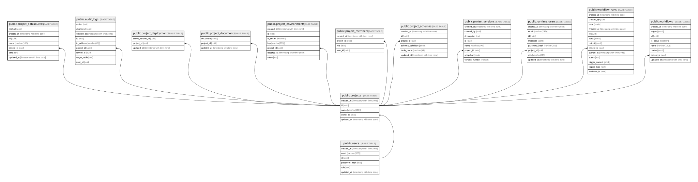

# public.project_datasources

## Description

프로젝트별 외부 데이터베이스 연결 설정

## Columns

| Name       | Type                     | Default           | Nullable | Children | Parents                               | Comment |
| ---------- | ------------------------ | ----------------- | -------- | -------- | ------------------------------------- | ------- |
| config     | jsonb                    |                   | false    |          |                                       |         |
| created_at | timestamp with time zone | CURRENT_TIMESTAMP | false    |          |                                       |         |
| id         | uuid                     | gen_random_uuid() | false    |          |                                       |         |
| name       | varchar(100)             |                   | false    |          |                                       |         |
| project_id | uuid                     |                   | false    |          | [public.projects](public.projects.md) |         |
| type       | text                     |                   | false    |          |                                       |         |
| updated_at | timestamp with time zone | CURRENT_TIMESTAMP | false    |          |                                       |         |

## Constraints

| Name                                | Type        | Definition                                                         |
| ----------------------------------- | ----------- | ------------------------------------------------------------------ |
| project_datasources_config_check    | CHECK       | CHECK ((jsonb_typeof(config) = 'object'::text))                    |
| project_datasources_name_check      | CHECK       | CHECK ((char_length(btrim((name)::text)) > 0))                     |
| project_datasources_pkey            | PRIMARY KEY | PRIMARY KEY (id)                                                   |
| project_datasources_project_id_fkey | FOREIGN KEY | FOREIGN KEY (project_id) REFERENCES projects(id) ON DELETE CASCADE |
| project_datasources_type_check      | CHECK       | CHECK ((type = 'POSTGRESQL'::text))                                |

## Indexes

| Name                                       | Definition                                                                                                                      |
| ------------------------------------------ | ------------------------------------------------------------------------------------------------------------------------------- |
| project_datasources_pkey                   | CREATE UNIQUE INDEX project_datasources_pkey ON public.project_datasources USING btree (id)                                     |
| project_datasources_project_updated_at_idx | CREATE INDEX project_datasources_project_updated_at_idx ON public.project_datasources USING btree (project_id, updated_at DESC) |

## Relations

---

> Generated by [tbls](https://github.com/k1LoW/tbls)
