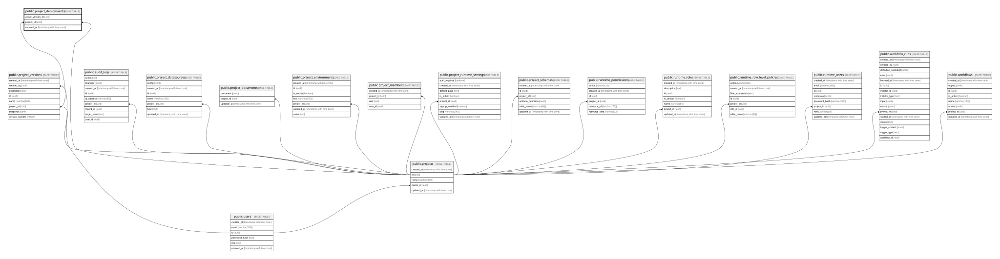

# public.project_deployments

## Description

프로젝트별 현재 프로덕션 배포 버전

## Columns

| Name              | Type                     | Default           | Nullable | Children | Parents                                                                                     | Comment |
| ----------------- | ------------------------ | ----------------- | -------- | -------- | ------------------------------------------------------------------------------------------- | ------- |
| active_version_id | uuid                     |                   | false    |          | [public.project_versions](public.project_versions.md)                                       |         |
| project_id        | uuid                     |                   | false    |          | [public.projects](public.projects.md) [public.project_versions](public.project_versions.md) |         |
| updated_at        | timestamp with time zone | CURRENT_TIMESTAMP | false    |          |                                                                                             |         |

## Constraints

| Name                                     | Type        | Definition                                                                              |
| ---------------------------------------- | ----------- | --------------------------------------------------------------------------------------- |
| project_deployments_pkey                 | PRIMARY KEY | PRIMARY KEY (project_id)                                                                |
| project_deployments_project_id_fkey      | FOREIGN KEY | FOREIGN KEY (project_id) REFERENCES projects(id) ON DELETE CASCADE                      |
| project_deployments_project_version_fkey | FOREIGN KEY | FOREIGN KEY (project_id, active_version_id) REFERENCES project_versions(project_id, id) |

## Indexes

| Name                     | Definition                                                                                          |
| ------------------------ | --------------------------------------------------------------------------------------------------- |
| project_deployments_pkey | CREATE UNIQUE INDEX project_deployments_pkey ON public.project_deployments USING btree (project_id) |

## Relations

---

> Generated by [tbls](https://github.com/k1LoW/tbls)
