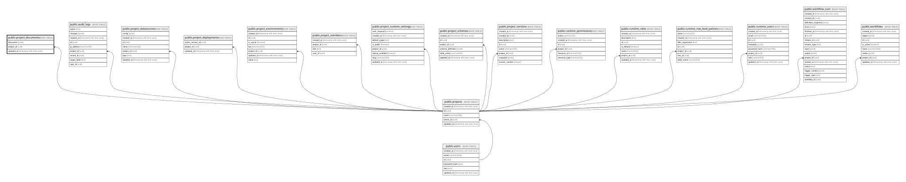

# public.project_documents

## Description

프로젝트 편집 상태를 보관하는 JSON 문서

## Columns

| Name       | Type                     | Default                                                | Nullable | Children | Parents                               | Comment |
| ---------- | ------------------------ | ------------------------------------------------------ | -------- | -------- | ------------------------------------- | ------- |
| document   | jsonb                    | '{"pages": [], "queries": [], "workflows": []}'::jsonb | false    |          |                                       |         |
| project_id | uuid                     |                                                        | false    |          | [public.projects](public.projects.md) |         |
| updated_at | timestamp with time zone | CURRENT_TIMESTAMP                                      | false    |          |                                       |         |

## Constraints

| Name                              | Type        | Definition                                                         |
| --------------------------------- | ----------- | ------------------------------------------------------------------ |
| project_documents_pkey            | PRIMARY KEY | PRIMARY KEY (project_id)                                           |
| project_documents_project_id_fkey | FOREIGN KEY | FOREIGN KEY (project_id) REFERENCES projects(id) ON DELETE CASCADE |

## Indexes

| Name                   | Definition                                                                                      |
| ---------------------- | ----------------------------------------------------------------------------------------------- |
| project_documents_pkey | CREATE UNIQUE INDEX project_documents_pkey ON public.project_documents USING btree (project_id) |

## Relations

---

> Generated by [tbls](https://github.com/k1LoW/tbls)
