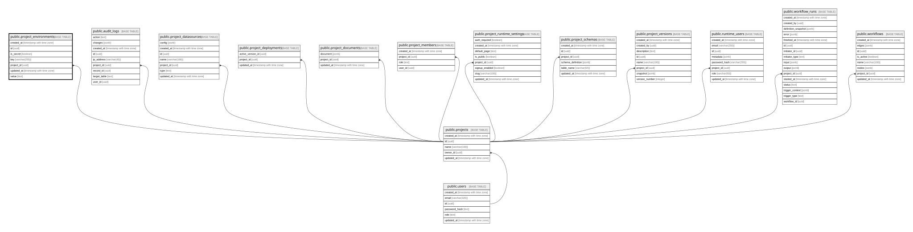

# public.project_environments

## Columns

| Name       | Type                     | Default           | Nullable | Children | Parents                               | Comment |
| ---------- | ------------------------ | ----------------- | -------- | -------- | ------------------------------------- | ------- |
| created_at | timestamp with time zone | CURRENT_TIMESTAMP | true     |          |                                       |         |
| id         | uuid                     | gen_random_uuid() | false    |          |                                       |         |
| is_secret  | boolean                  | false             | true     |          |                                       |         |
| key        | varchar(255)             |                   | false    |          |                                       |         |
| project_id | uuid                     |                   | false    |          | [public.projects](public.projects.md) |         |
| updated_at | timestamp with time zone | CURRENT_TIMESTAMP | true     |          |                                       |         |
| value      | text                     |                   | false    |          |                                       |         |

## Constraints

| Name                                 | Type        | Definition                                                         |
| ------------------------------------ | ----------- | ------------------------------------------------------------------ |
| project_environments_pkey            | PRIMARY KEY | PRIMARY KEY (id)                                                   |
| project_environments_project_id_fkey | FOREIGN KEY | FOREIGN KEY (project_id) REFERENCES projects(id) ON DELETE CASCADE |
| unique_project_env_key               | UNIQUE      | UNIQUE (project_id, key)                                           |

## Indexes

| Name                                | Definition                                                                                               |
| ----------------------------------- | -------------------------------------------------------------------------------------------------------- |
| idx_project_environments_project_id | CREATE INDEX idx_project_environments_project_id ON public.project_environments USING btree (project_id) |
| project_environments_pkey           | CREATE UNIQUE INDEX project_environments_pkey ON public.project_environments USING btree (id)            |
| unique_project_env_key              | CREATE UNIQUE INDEX unique_project_env_key ON public.project_environments USING btree (project_id, key)  |

## Triggers

| Name                                   | Definition                                                                                                                                                  |
| -------------------------------------- | ----------------------------------------------------------------------------------------------------------------------------------------------------------- |
| update_project_environments_updated_at | CREATE TRIGGER update_project_environments_updated_at BEFORE UPDATE ON public.project_environments FOR EACH ROW EXECUTE FUNCTION update_updated_at_column() |

## Relations

---

> Generated by [tbls](https://github.com/k1LoW/tbls)
