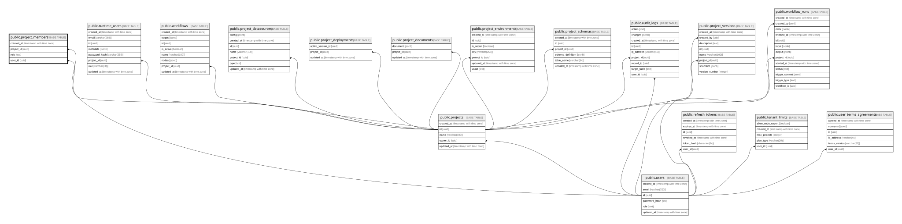

# public.project_members

## Description

프로젝트별 협업 권한

## Columns

| Name       | Type                     | Default           | Nullable | Children | Parents                               | Comment |
| ---------- | ------------------------ | ----------------- | -------- | -------- | ------------------------------------- | ------- |
| created_at | timestamp with time zone | CURRENT_TIMESTAMP | false    |          |                                       |         |
| project_id | uuid                     |                   | false    |          | [public.projects](public.projects.md) |         |
| role       | text                     |                   | false    |          |                                       |         |
| user_id    | uuid                     |                   | false    |          | [public.users](public.users.md)       |         |

## Constraints

| Name                            | Type        | Definition                                                                  |
| ------------------------------- | ----------- | --------------------------------------------------------------------------- |
| project_members_pkey            | PRIMARY KEY | PRIMARY KEY (project_id, user_id)                                           |
| project_members_project_id_fkey | FOREIGN KEY | FOREIGN KEY (project_id) REFERENCES projects(id) ON DELETE CASCADE          |
| project_members_role_check      | CHECK       | CHECK ((role = ANY (ARRAY['owner'::text, 'editor'::text, 'viewer'::text]))) |
| project_members_user_id_fkey    | FOREIGN KEY | FOREIGN KEY (user_id) REFERENCES users(id) ON DELETE CASCADE                |

## Indexes

| Name                             | Definition                                                                                                |
| -------------------------------- | --------------------------------------------------------------------------------------------------------- |
| project_members_pkey             | CREATE UNIQUE INDEX project_members_pkey ON public.project_members USING btree (project_id, user_id)      |
| project_members_user_project_idx | CREATE INDEX project_members_user_project_idx ON public.project_members USING btree (user_id, project_id) |

## Relations

---

> Generated by [tbls](https://github.com/k1LoW/tbls)
