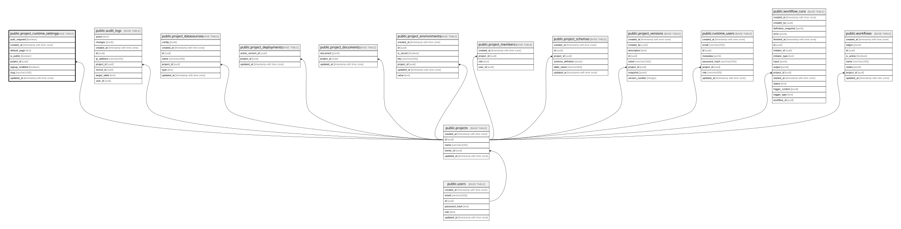

# public.project_runtime_settings

## Description

배포된 프로젝트를 런타임 앱으로 노출하기 위한 슬러그·공개 설정

## Columns

| Name           | Type                     | Default           | Nullable | Children | Parents                               | Comment |
| -------------- | ------------------------ | ----------------- | -------- | -------- | ------------------------------------- | ------- |
| auth_required  | boolean                  | true              | false    |          |                                       |         |
| created_at     | timestamp with time zone | CURRENT_TIMESTAMP | false    |          |                                       |         |
| default_page   | text                     | '/'::text         | false    |          |                                       |         |
| is_public      | boolean                  | false             | false    |          |                                       |         |
| project_id     | uuid                     |                   | false    |          | [public.projects](public.projects.md) |         |
| signup_enabled | boolean                  | false             | false    |          |                                       |         |
| slug           | varchar(100)             |                   | false    |          |                                       |         |
| updated_at     | timestamp with time zone | CURRENT_TIMESTAMP | false    |          |                                       |         |

## Constraints

| Name                                     | Type        | Definition                                                            |
| ---------------------------------------- | ----------- | --------------------------------------------------------------------- |
| project_runtime_settings_pkey            | PRIMARY KEY | PRIMARY KEY (project_id)                                              |
| project_runtime_settings_project_id_fkey | FOREIGN KEY | FOREIGN KEY (project_id) REFERENCES projects(id) ON DELETE CASCADE    |
| project_runtime_settings_slug_check      | CHECK       | CHECK (((slug)::text ~ '^[a-z0-9]([a-z0-9-]{0,98}[a-z0-9])?$'::text)) |
| project_runtime_settings_slug_key        | UNIQUE      | UNIQUE (slug)                                                         |

## Indexes

| Name                              | Definition                                                                                                    |
| --------------------------------- | ------------------------------------------------------------------------------------------------------------- |
| project_runtime_settings_pkey     | CREATE UNIQUE INDEX project_runtime_settings_pkey ON public.project_runtime_settings USING btree (project_id) |
| project_runtime_settings_slug_key | CREATE UNIQUE INDEX project_runtime_settings_slug_key ON public.project_runtime_settings USING btree (slug)   |

## Triggers

| Name                                       | Definition                                                                                                                                                          |
| ------------------------------------------ | ------------------------------------------------------------------------------------------------------------------------------------------------------------------- |
| update_project_runtime_settings_updated_at | CREATE TRIGGER update_project_runtime_settings_updated_at BEFORE UPDATE ON public.project_runtime_settings FOR EACH ROW EXECUTE FUNCTION update_updated_at_column() |

## Relations

---

> Generated by [tbls](https://github.com/k1LoW/tbls)
