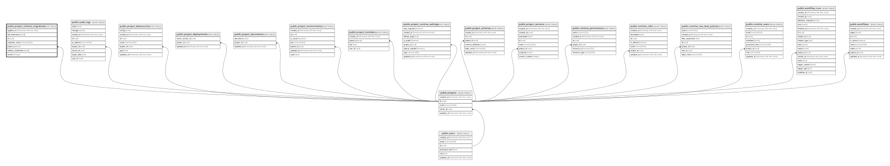

# public.project_schema_migrations

## Columns

| Name                | Type                     | Default           | Nullable | Children | Parents                               | Comment |
| ------------------- | ------------------------ | ----------------- | -------- | -------- | ------------------------------------- | ------- |
| applied_at          | timestamp with time zone | now()             | false    |          |                                       |         |
| ddl_statements      | text[]                   |                   | false    |          |                                       |         |
| id                  | uuid                     | gen_random_uuid() | false    |          |                                       |         |
| migration_name      | varchar(255)             |                   | false    |          |                                       |         |
| project_id          | uuid                     |                   | false    |          | [public.projects](public.projects.md) |         |
| rollback_statements | text[]                   |                   | true     |          |                                       |         |
| version             | integer                  |                   | false    |          |                                       |         |

## Constraints

| Name                                             | Type        | Definition                                                         |
| ------------------------------------------------ | ----------- | ------------------------------------------------------------------ |
| project_schema_migrations_pkey                   | PRIMARY KEY | PRIMARY KEY (id)                                                   |
| project_schema_migrations_project_id_fkey        | FOREIGN KEY | FOREIGN KEY (project_id) REFERENCES projects(id) ON DELETE CASCADE |
| project_schema_migrations_project_id_version_key | UNIQUE      | UNIQUE (project_id, version)                                       |

## Indexes

| Name                                             | Definition                                                                                                                                 |
| ------------------------------------------------ | ------------------------------------------------------------------------------------------------------------------------------------------ |
| idx_project_schema_migrations_project            | CREATE INDEX idx_project_schema_migrations_project ON public.project_schema_migrations USING btree (project_id, version DESC)              |
| project_schema_migrations_pkey                   | CREATE UNIQUE INDEX project_schema_migrations_pkey ON public.project_schema_migrations USING btree (id)                                    |
| project_schema_migrations_project_id_version_key | CREATE UNIQUE INDEX project_schema_migrations_project_id_version_key ON public.project_schema_migrations USING btree (project_id, version) |

## Relations

---

> Generated by [tbls](https://github.com/k1LoW/tbls)
