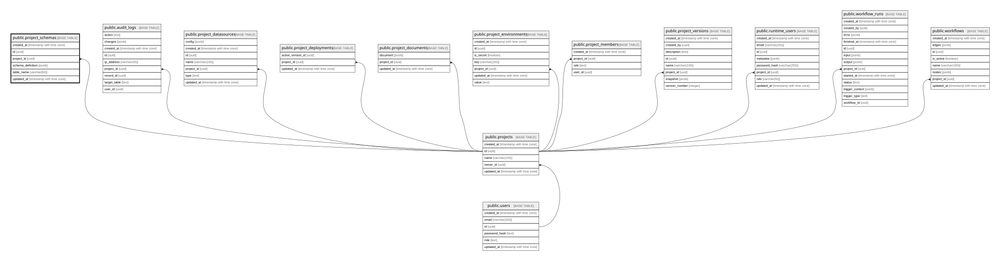

# public.project_schemas

## Description

프로젝트별 동적 데이터 스키마 정의

## Columns

| Name              | Type                     | Default           | Nullable | Children | Parents                               | Comment |
| ----------------- | ------------------------ | ----------------- | -------- | -------- | ------------------------------------- | ------- |
| created_at        | timestamp with time zone | now()             | true     |          |                                       |         |
| id                | uuid                     | gen_random_uuid() | false    |          |                                       |         |
| project_id        | uuid                     |                   | false    |          | [public.projects](public.projects.md) |         |
| schema_definition | jsonb                    |                   | false    |          |                                       |         |
| table_name        | varchar(64)              |                   | false    |          |                                       |         |
| updated_at        | timestamp with time zone | now()             | true     |          |                                       |         |

## Constraints

| Name                            | Type        | Definition                                                         |
| ------------------------------- | ----------- | ------------------------------------------------------------------ |
| project_schemas_pkey            | PRIMARY KEY | PRIMARY KEY (id)                                                   |
| project_schemas_project_id_fkey | FOREIGN KEY | FOREIGN KEY (project_id) REFERENCES projects(id) ON DELETE CASCADE |
| uq_project_schema_table         | UNIQUE      | UNIQUE (project_id, table_name)                                    |

## Indexes

| Name                    | Definition                                                                                                 |
| ----------------------- | ---------------------------------------------------------------------------------------------------------- |
| project_schemas_pkey    | CREATE UNIQUE INDEX project_schemas_pkey ON public.project_schemas USING btree (id)                        |
| uq_project_schema_table | CREATE UNIQUE INDEX uq_project_schema_table ON public.project_schemas USING btree (project_id, table_name) |

## Relations

---

> Generated by [tbls](https://github.com/k1LoW/tbls)
