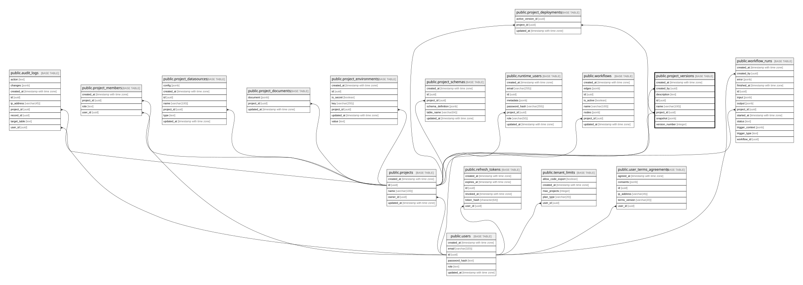

# public.project_versions

## Description

프로젝트별 릴리즈 버전 스냅샷

## Columns

| Name           | Type                     | Default           | Nullable | Children                                                    | Parents                               | Comment |
| -------------- | ------------------------ | ----------------- | -------- | ----------------------------------------------------------- | ------------------------------------- | ------- |
| created_at     | timestamp with time zone | CURRENT_TIMESTAMP | false    |                                                             |                                       |         |
| created_by     | uuid                     |                   | true     |                                                             | [public.users](public.users.md)       |         |
| description    | text                     |                   | true     |                                                             |                                       |         |
| id             | uuid                     | gen_random_uuid() | false    | [public.project_deployments](public.project_deployments.md) |                                       |         |
| name           | varchar(100)             |                   | false    |                                                             |                                       |         |
| project_id     | uuid                     |                   | false    | [public.project_deployments](public.project_deployments.md) | [public.projects](public.projects.md) |         |
| snapshot       | jsonb                    |                   | false    |                                                             |                                       |         |
| version_number | integer                  |                   | false    |                                                             |                                       |         |

## Constraints

| Name                                        | Type        | Definition                                                         |
| ------------------------------------------- | ----------- | ------------------------------------------------------------------ |
| project_versions_created_by_fkey            | FOREIGN KEY | FOREIGN KEY (created_by) REFERENCES users(id) ON DELETE SET NULL   |
| project_versions_name_check                 | CHECK       | CHECK ((char_length(btrim((name)::text)) > 0))                     |
| project_versions_pkey                       | PRIMARY KEY | PRIMARY KEY (id)                                                   |
| project_versions_project_id_fkey            | FOREIGN KEY | FOREIGN KEY (project_id) REFERENCES projects(id) ON DELETE CASCADE |
| project_versions_project_id_id_key          | UNIQUE      | UNIQUE (project_id, id)                                            |
| project_versions_project_version_number_key | UNIQUE      | UNIQUE (project_id, version_number)                                |
| project_versions_version_number_check       | CHECK       | CHECK ((version_number > 0))                                       |

## Indexes

| Name                                        | Definition                                                                                                                          |
| ------------------------------------------- | ----------------------------------------------------------------------------------------------------------------------------------- |
| project_versions_pkey                       | CREATE UNIQUE INDEX project_versions_pkey ON public.project_versions USING btree (id)                                               |
| project_versions_project_created_at_idx     | CREATE INDEX project_versions_project_created_at_idx ON public.project_versions USING btree (project_id, created_at DESC)           |
| project_versions_project_id_id_key          | CREATE UNIQUE INDEX project_versions_project_id_id_key ON public.project_versions USING btree (project_id, id)                      |
| project_versions_project_version_number_key | CREATE UNIQUE INDEX project_versions_project_version_number_key ON public.project_versions USING btree (project_id, version_number) |

## Relations

---

> Generated by [tbls](https://github.com/k1LoW/tbls)
