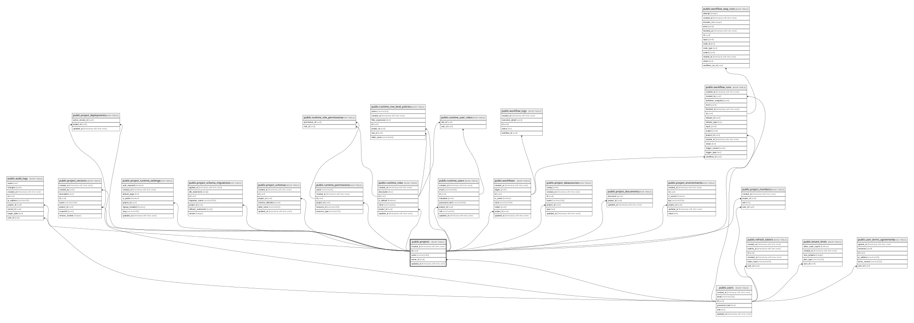

# public.projects

## Description

사용자가 소유하는 앱 빌더 프로젝트

## Columns

| Name       | Type                     | Default           | Nullable | Children                                                                                                                                                                                                                                                                                                                                                                                                                                                                                                                                                                                                                                                                                                                                                                                                                                                                                                                          | Parents                         | Comment |
| ---------- | ------------------------ | ----------------- | -------- | --------------------------------------------------------------------------------------------------------------------------------------------------------------------------------------------------------------------------------------------------------------------------------------------------------------------------------------------------------------------------------------------------------------------------------------------------------------------------------------------------------------------------------------------------------------------------------------------------------------------------------------------------------------------------------------------------------------------------------------------------------------------------------------------------------------------------------------------------------------------------------------------------------------------------------- | ------------------------------- | ------- |
| created_at | timestamp with time zone | CURRENT_TIMESTAMP | false    |                                                                                                                                                                                                                                                                                                                                                                                                                                                                                                                                                                                                                                                                                                                                                                                                                                                                                                                                   |                                 |         |
| id         | uuid                     | gen_random_uuid() | false    | [public.audit_logs](public.audit_logs.md) [public.project_datasources](public.project_datasources.md) [public.project_deployments](public.project_deployments.md) [public.project_documents](public.project_documents.md) [public.project_environments](public.project_environments.md) [public.project_members](public.project_members.md) [public.project_runtime_settings](public.project_runtime_settings.md) [public.project_schema_migrations](public.project_schema_migrations.md) [public.project_schemas](public.project_schemas.md) [public.project_versions](public.project_versions.md) [public.runtime_permissions](public.runtime_permissions.md) [public.runtime_roles](public.runtime_roles.md) [public.runtime_row_level_policies](public.runtime_row_level_policies.md) [public.runtime_users](public.runtime_users.md) [public.workflow_runs](public.workflow_runs.md) [public.workflows](public.workflows.md) |                                 |         |
| name       | varchar(100)             |                   | false    |                                                                                                                                                                                                                                                                                                                                                                                                                                                                                                                                                                                                                                                                                                                                                                                                                                                                                                                                   |                                 |         |
| owner_id   | uuid                     |                   | false    |                                                                                                                                                                                                                                                                                                                                                                                                                                                                                                                                                                                                                                                                                                                                                                                                                                                                                                                                   | [public.users](public.users.md) |         |
| updated_at | timestamp with time zone | CURRENT_TIMESTAMP | false    |                                                                                                                                                                                                                                                                                                                                                                                                                                                                                                                                                                                                                                                                                                                                                                                                                                                                                                                                   |                                 |         |

## Constraints

| Name                   | Type        | Definition                                                    |
| ---------------------- | ----------- | ------------------------------------------------------------- |
| projects_name_check    | CHECK       | CHECK ((char_length(btrim((name)::text)) > 0))                |
| projects_owner_id_fkey | FOREIGN KEY | FOREIGN KEY (owner_id) REFERENCES users(id) ON DELETE CASCADE |
| projects_pkey          | PRIMARY KEY | PRIMARY KEY (id)                                              |

## Indexes

| Name                          | Definition                                                                                            |
| ----------------------------- | ----------------------------------------------------------------------------------------------------- |
| projects_owner_updated_at_idx | CREATE INDEX projects_owner_updated_at_idx ON public.projects USING btree (owner_id, updated_at DESC) |
| projects_pkey                 | CREATE UNIQUE INDEX projects_pkey ON public.projects USING btree (id)                                 |

## Relations

---

> Generated by [tbls](https://github.com/k1LoW/tbls)
