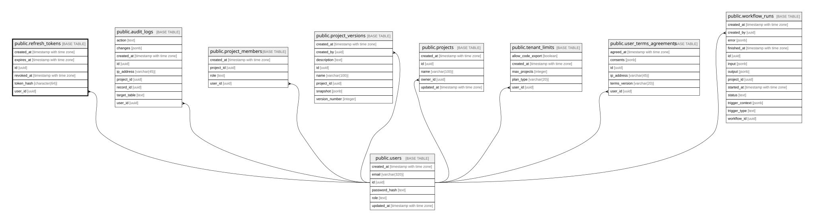

# public.refresh_tokens

## Description

해시된 갱신 토큰

## Columns

| Name       | Type                     | Default           | Nullable | Children | Parents                         | Comment |
| ---------- | ------------------------ | ----------------- | -------- | -------- | ------------------------------- | ------- |
| created_at | timestamp with time zone | CURRENT_TIMESTAMP | false    |          |                                 |         |
| expires_at | timestamp with time zone |                   | false    |          |                                 |         |
| id         | uuid                     | gen_random_uuid() | false    |          |                                 |         |
| revoked_at | timestamp with time zone |                   | true     |          |                                 |         |
| token_hash | character(64)            |                   | false    |          |                                 |         |
| user_id    | uuid                     |                   | false    |          | [public.users](public.users.md) |         |

## Constraints

| Name                          | Type        | Definition                                                   |
| ----------------------------- | ----------- | ------------------------------------------------------------ |
| refresh_tokens_pkey           | PRIMARY KEY | PRIMARY KEY (id)                                             |
| refresh_tokens_token_hash_key | UNIQUE      | UNIQUE (token_hash)                                          |
| refresh_tokens_user_id_fkey   | FOREIGN KEY | FOREIGN KEY (user_id) REFERENCES users(id) ON DELETE CASCADE |

## Indexes

| Name                          | Definition                                                                                          |
| ----------------------------- | --------------------------------------------------------------------------------------------------- |
| refresh_tokens_pkey           | CREATE UNIQUE INDEX refresh_tokens_pkey ON public.refresh_tokens USING btree (id)                   |
| refresh_tokens_token_hash_key | CREATE UNIQUE INDEX refresh_tokens_token_hash_key ON public.refresh_tokens USING btree (token_hash) |
| refresh_tokens_user_id_idx    | CREATE INDEX refresh_tokens_user_id_idx ON public.refresh_tokens USING btree (user_id)              |

## Relations

---

> Generated by [tbls](https://github.com/k1LoW/tbls)
