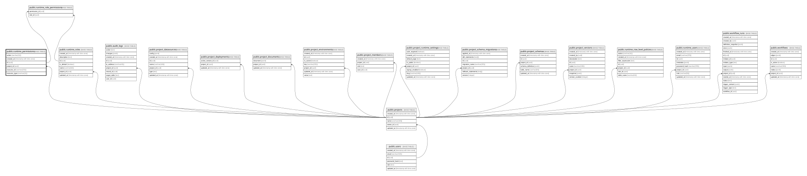

# public.runtime_permissions

## Columns

| Name          | Type                     | Default           | Nullable | Children                                                              | Parents                               | Comment |
| ------------- | ------------------------ | ----------------- | -------- | --------------------------------------------------------------------- | ------------------------------------- | ------- |
| action        | varchar(32)              |                   | false    |                                                                       |                                       |         |
| created_at    | timestamp with time zone | now()             | false    |                                                                       |                                       |         |
| id            | uuid                     | gen_random_uuid() | false    | [public.runtime_role_permissions](public.runtime_role_permissions.md) |                                       |         |
| project_id    | uuid                     |                   | false    |                                                                       | [public.projects](public.projects.md) |         |
| resource_id   | varchar(255)             |                   | false    |                                                                       |                                       |         |
| resource_type | varchar(32)              |                   | false    |                                                                       |                                       |         |

## Constraints

| Name                                                            | Type        | Definition                                                         |
| --------------------------------------------------------------- | ----------- | ------------------------------------------------------------------ |
| runtime_permissions_pkey                                        | PRIMARY KEY | PRIMARY KEY (id)                                                   |
| runtime_permissions_project_id_fkey                             | FOREIGN KEY | FOREIGN KEY (project_id) REFERENCES projects(id) ON DELETE CASCADE |
| runtime_permissions_project_id_resource_type_resource_id_ac_key | UNIQUE      | UNIQUE (project_id, resource_type, resource_id, action)            |

## Indexes

| Name                                                            | Definition                                                                                                                                                                     |
| --------------------------------------------------------------- | ------------------------------------------------------------------------------------------------------------------------------------------------------------------------------ |
| runtime_permissions_pkey                                        | CREATE UNIQUE INDEX runtime_permissions_pkey ON public.runtime_permissions USING btree (id)                                                                                    |
| runtime_permissions_project_id_resource_type_resource_id_ac_key | CREATE UNIQUE INDEX runtime_permissions_project_id_resource_type_resource_id_ac_key ON public.runtime_permissions USING btree (project_id, resource_type, resource_id, action) |

## Relations

---

> Generated by [tbls](https://github.com/k1LoW/tbls)
