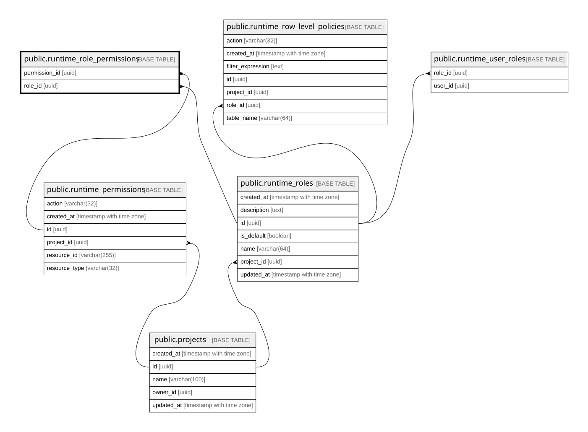

# public.runtime_role_permissions

## Columns

| Name          | Type | Default | Nullable | Children | Parents                                                     | Comment |
| ------------- | ---- | ------- | -------- | -------- | ----------------------------------------------------------- | ------- |
| permission_id | uuid |         | false    |          | [public.runtime_permissions](public.runtime_permissions.md) |         |
| role_id       | uuid |         | false    |          | [public.runtime_roles](public.runtime_roles.md)             |         |

## Constraints

| Name                                        | Type        | Definition                                                                       |
| ------------------------------------------- | ----------- | -------------------------------------------------------------------------------- |
| runtime_role_permissions_permission_id_fkey | FOREIGN KEY | FOREIGN KEY (permission_id) REFERENCES runtime_permissions(id) ON DELETE CASCADE |
| runtime_role_permissions_pkey               | PRIMARY KEY | PRIMARY KEY (role_id, permission_id)                                             |
| runtime_role_permissions_role_id_fkey       | FOREIGN KEY | FOREIGN KEY (role_id) REFERENCES runtime_roles(id) ON DELETE CASCADE             |

## Indexes

| Name                          | Definition                                                                                                                |
| ----------------------------- | ------------------------------------------------------------------------------------------------------------------------- |
| runtime_role_permissions_pkey | CREATE UNIQUE INDEX runtime_role_permissions_pkey ON public.runtime_role_permissions USING btree (role_id, permission_id) |

## Relations

---

> Generated by [tbls](https://github.com/k1LoW/tbls)
