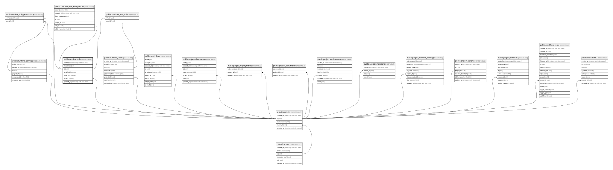

# public.runtime_roles

## Columns

| Name        | Type                     | Default           | Nullable | Children                                                                                                                                                                                                  | Parents                               | Comment |
| ----------- | ------------------------ | ----------------- | -------- | --------------------------------------------------------------------------------------------------------------------------------------------------------------------------------------------------------- | ------------------------------------- | ------- |
| created_at  | timestamp with time zone | now()             | false    |                                                                                                                                                                                                           |                                       |         |
| description | text                     |                   | true     |                                                                                                                                                                                                           |                                       |         |
| id          | uuid                     | gen_random_uuid() | false    | [public.runtime_role_permissions](public.runtime_role_permissions.md) [public.runtime_row_level_policies](public.runtime_row_level_policies.md) [public.runtime_user_roles](public.runtime_user_roles.md) |                                       |         |
| is_default  | boolean                  | false             | false    |                                                                                                                                                                                                           |                                       |         |
| name        | varchar(64)              |                   | false    |                                                                                                                                                                                                           |                                       |         |
| project_id  | uuid                     |                   | false    |                                                                                                                                                                                                           | [public.projects](public.projects.md) |         |
| updated_at  | timestamp with time zone | now()             | false    |                                                                                                                                                                                                           |                                       |         |

## Constraints

| Name                              | Type        | Definition                                                         |
| --------------------------------- | ----------- | ------------------------------------------------------------------ |
| runtime_roles_pkey                | PRIMARY KEY | PRIMARY KEY (id)                                                   |
| runtime_roles_project_id_fkey     | FOREIGN KEY | FOREIGN KEY (project_id) REFERENCES projects(id) ON DELETE CASCADE |
| runtime_roles_project_id_name_key | UNIQUE      | UNIQUE (project_id, name)                                          |

## Indexes

| Name                              | Definition                                                                                                   |
| --------------------------------- | ------------------------------------------------------------------------------------------------------------ |
| runtime_roles_pkey                | CREATE UNIQUE INDEX runtime_roles_pkey ON public.runtime_roles USING btree (id)                              |
| runtime_roles_project_id_name_key | CREATE UNIQUE INDEX runtime_roles_project_id_name_key ON public.runtime_roles USING btree (project_id, name) |

## Relations

---

> Generated by [tbls](https://github.com/k1LoW/tbls)
