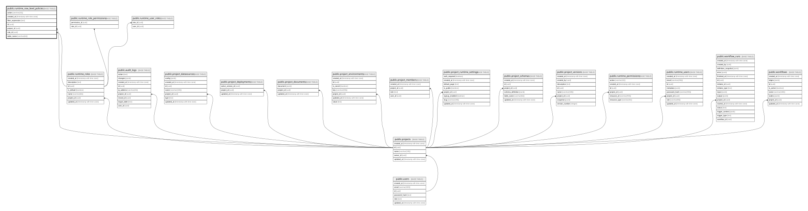

# public.runtime_row_level_policies

## Columns

| Name              | Type                     | Default                   | Nullable | Children | Parents                                         | Comment |
| ----------------- | ------------------------ | ------------------------- | -------- | -------- | ----------------------------------------------- | ------- |
| action            | varchar(32)              | 'READ'::character varying | false    |          |                                                 |         |
| created_at        | timestamp with time zone | now()                     | false    |          |                                                 |         |
| filter_expression | text                     |                           | false    |          |                                                 |         |
| id                | uuid                     | gen_random_uuid()         | false    |          |                                                 |         |
| project_id        | uuid                     |                           | false    |          | [public.projects](public.projects.md)           |         |
| role_id           | uuid                     |                           | true     |          | [public.runtime_roles](public.runtime_roles.md) |         |
| table_name        | varchar(64)              |                           | false    |          |                                                 |         |

## Constraints

| Name                                       | Type        | Definition                                                           |
| ------------------------------------------ | ----------- | -------------------------------------------------------------------- |
| runtime_row_level_policies_pkey            | PRIMARY KEY | PRIMARY KEY (id)                                                     |
| runtime_row_level_policies_project_id_fkey | FOREIGN KEY | FOREIGN KEY (project_id) REFERENCES projects(id) ON DELETE CASCADE   |
| runtime_row_level_policies_role_id_fkey    | FOREIGN KEY | FOREIGN KEY (role_id) REFERENCES runtime_roles(id) ON DELETE CASCADE |

## Indexes

| Name                            | Definition                                                                                                   |
| ------------------------------- | ------------------------------------------------------------------------------------------------------------ |
| idx_runtime_rlp_table           | CREATE INDEX idx_runtime_rlp_table ON public.runtime_row_level_policies USING btree (project_id, table_name) |
| runtime_row_level_policies_pkey | CREATE UNIQUE INDEX runtime_row_level_policies_pkey ON public.runtime_row_level_policies USING btree (id)    |

## Relations

---

> Generated by [tbls](https://github.com/k1LoW/tbls)
