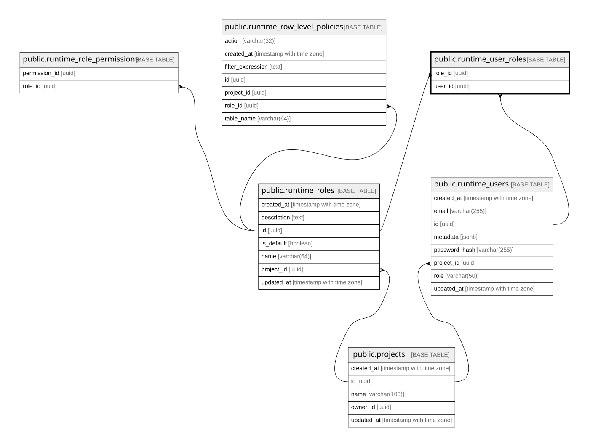

# public.runtime_user_roles

## Columns

| Name    | Type | Default | Nullable | Children | Parents                                         | Comment |
| ------- | ---- | ------- | -------- | -------- | ----------------------------------------------- | ------- |
| role_id | uuid |         | false    |          | [public.runtime_roles](public.runtime_roles.md) |         |
| user_id | uuid |         | false    |          | [public.runtime_users](public.runtime_users.md) |         |

## Constraints

| Name                            | Type        | Definition                                                           |
| ------------------------------- | ----------- | -------------------------------------------------------------------- |
| runtime_user_roles_pkey         | PRIMARY KEY | PRIMARY KEY (user_id, role_id)                                       |
| runtime_user_roles_role_id_fkey | FOREIGN KEY | FOREIGN KEY (role_id) REFERENCES runtime_roles(id) ON DELETE CASCADE |
| runtime_user_roles_user_id_fkey | FOREIGN KEY | FOREIGN KEY (user_id) REFERENCES runtime_users(id) ON DELETE CASCADE |

## Indexes

| Name                        | Definition                                                                                              |
| --------------------------- | ------------------------------------------------------------------------------------------------------- |
| idx_runtime_user_roles_user | CREATE INDEX idx_runtime_user_roles_user ON public.runtime_user_roles USING btree (user_id)             |
| runtime_user_roles_pkey     | CREATE UNIQUE INDEX runtime_user_roles_pkey ON public.runtime_user_roles USING btree (user_id, role_id) |

## Relations

---

> Generated by [tbls](https://github.com/k1LoW/tbls)
