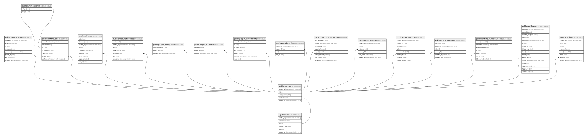

# public.runtime_users

## Columns

| Name          | Type                     | Default                   | Nullable | Children | Parents                               | Comment |
| ------------- | ------------------------ | ------------------------- | -------- | -------- | ------------------------------------- | ------- |
| created_at    | timestamp with time zone | CURRENT_TIMESTAMP         | true     |          |                                       |         |
| email         | varchar(255)             |                           | false    |          |                                       |         |
| id            | uuid                     | gen_random_uuid()         | false    |          |                                       |         |
| metadata      | jsonb                    | '{}'::jsonb               | true     |          |                                       |         |
| password_hash | varchar(255)             |                           | false    |          |                                       |         |
| project_id    | uuid                     |                           | false    |          | [public.projects](public.projects.md) |         |
| role          | varchar(50)              | 'user'::character varying | false    |          |                                       |         |
| updated_at    | timestamp with time zone | CURRENT_TIMESTAMP         | true     |          |                                       |         |

## Constraints

| Name                              | Type        | Definition                                                         |
| --------------------------------- | ----------- | ------------------------------------------------------------------ |
| runtime_users_pkey                | PRIMARY KEY | PRIMARY KEY (id)                                                   |
| runtime_users_project_id_fkey     | FOREIGN KEY | FOREIGN KEY (project_id) REFERENCES projects(id) ON DELETE CASCADE |
| unique_project_runtime_user_email | UNIQUE      | UNIQUE (project_id, email)                                         |

## Indexes

| Name                              | Definition                                                                                                    |
| --------------------------------- | ------------------------------------------------------------------------------------------------------------- |
| idx_runtime_users_project_email   | CREATE INDEX idx_runtime_users_project_email ON public.runtime_users USING btree (project_id, email)          |
| runtime_users_pkey                | CREATE UNIQUE INDEX runtime_users_pkey ON public.runtime_users USING btree (id)                               |
| unique_project_runtime_user_email | CREATE UNIQUE INDEX unique_project_runtime_user_email ON public.runtime_users USING btree (project_id, email) |

## Triggers

| Name                            | Definition                                                                                                                                    |
| ------------------------------- | --------------------------------------------------------------------------------------------------------------------------------------------- |
| update_runtime_users_updated_at | CREATE TRIGGER update_runtime_users_updated_at BEFORE UPDATE ON public.runtime_users FOR EACH ROW EXECUTE FUNCTION update_updated_at_column() |

## Relations

---

> Generated by [tbls](https://github.com/k1LoW/tbls)
