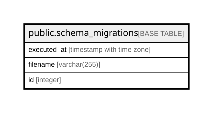

# public.schema_migrations

## Columns

| Name        | Type                     | Default                                       | Nullable | Children | Parents | Comment |
| ----------- | ------------------------ | --------------------------------------------- | -------- | -------- | ------- | ------- |
| executed_at | timestamp with time zone | now()                                         | false    |          |         |         |
| filename    | varchar(255)             |                                               | false    |          |         |         |
| id          | integer                  | nextval('schema_migrations_id_seq'::regclass) | false    |          |         |         |

## Constraints

| Name                           | Type        | Definition        |
| ------------------------------ | ----------- | ----------------- |
| schema_migrations_filename_key | UNIQUE      | UNIQUE (filename) |
| schema_migrations_pkey         | PRIMARY KEY | PRIMARY KEY (id)  |

## Indexes

| Name                           | Definition                                                                                            |
| ------------------------------ | ----------------------------------------------------------------------------------------------------- |
| schema_migrations_filename_key | CREATE UNIQUE INDEX schema_migrations_filename_key ON public.schema_migrations USING btree (filename) |
| schema_migrations_pkey         | CREATE UNIQUE INDEX schema_migrations_pkey ON public.schema_migrations USING btree (id)               |

## Relations

---

> Generated by [tbls](https://github.com/k1LoW/tbls)
