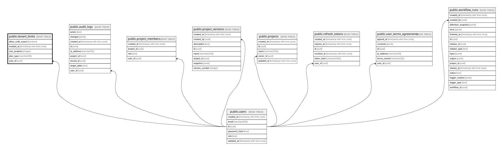

# public.tenant_limits

## Description

사용자 플랜별 프로젝트 및 내보내기 한도

## Columns

| Name              | Type                     | Default                   | Nullable | Children | Parents                         | Comment |
| ----------------- | ------------------------ | ------------------------- | -------- | -------- | ------------------------------- | ------- |
| allow_code_export | boolean                  | true                      | true     |          |                                 |         |
| created_at        | timestamp with time zone | now()                     | true     |          |                                 |         |
| max_projects      | integer                  | 3                         | true     |          |                                 |         |
| plan_type         | varchar(20)              | 'FREE'::character varying | true     |          |                                 |         |
| user_id           | uuid                     |                           | false    |          | [public.users](public.users.md) |         |

## Constraints

| Name                       | Type        | Definition                                                   |
| -------------------------- | ----------- | ------------------------------------------------------------ |
| tenant_limits_pkey         | PRIMARY KEY | PRIMARY KEY (user_id)                                        |
| tenant_limits_user_id_fkey | FOREIGN KEY | FOREIGN KEY (user_id) REFERENCES users(id) ON DELETE CASCADE |

## Indexes

| Name               | Definition                                                                           |
| ------------------ | ------------------------------------------------------------------------------------ |
| tenant_limits_pkey | CREATE UNIQUE INDEX tenant_limits_pkey ON public.tenant_limits USING btree (user_id) |

## Relations

---

> Generated by [tbls](https://github.com/k1LoW/tbls)
