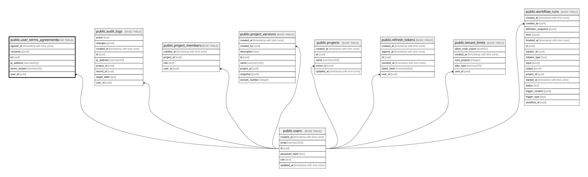

# public.user_terms_agreements

## Description

사용자 약관 및 선택 동의 이력

## Columns

| Name          | Type                     | Default           | Nullable | Children | Parents                         | Comment |
| ------------- | ------------------------ | ----------------- | -------- | -------- | ------------------------------- | ------- |
| agreed_at     | timestamp with time zone | now()             | true     |          |                                 |         |
| consents      | jsonb                    | '{}'::jsonb       | false    |          |                                 |         |
| id            | uuid                     | gen_random_uuid() | false    |          |                                 |         |
| ip_address    | varchar(45)              |                   | true     |          |                                 |         |
| terms_version | varchar(20)              |                   | false    |          |                                 |         |
| user_id       | uuid                     |                   | false    |          | [public.users](public.users.md) |         |

## Constraints

| Name                               | Type        | Definition                                                   |
| ---------------------------------- | ----------- | ------------------------------------------------------------ |
| user_terms_agreements_pkey         | PRIMARY KEY | PRIMARY KEY (id)                                             |
| user_terms_agreements_user_id_fkey | FOREIGN KEY | FOREIGN KEY (user_id) REFERENCES users(id) ON DELETE CASCADE |

## Indexes

| Name                       | Definition                                                                                      |
| -------------------------- | ----------------------------------------------------------------------------------------------- |
| user_terms_agreements_pkey | CREATE UNIQUE INDEX user_terms_agreements_pkey ON public.user_terms_agreements USING btree (id) |

## Relations

---

> Generated by [tbls](https://github.com/k1LoW/tbls)
