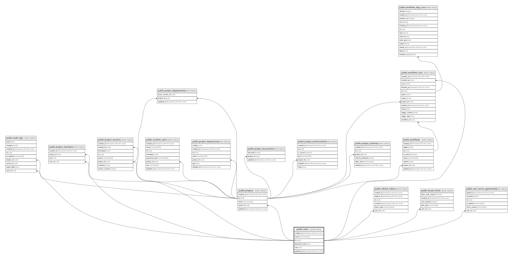

# public.users

## Description

BakeApp 자체 인증 사용자

## Columns

| Name          | Type                     | Default           | Nullable | Children                                                                                                                                                                                                                                                    | Parents | Comment |
| ------------- | ------------------------ | ----------------- | -------- | ----------------------------------------------------------------------------------------------------------------------------------------------------------------------------------------------------------------------------------------------------------- | ------- | ------- |
| created_at    | timestamp with time zone | CURRENT_TIMESTAMP | false    |                                                                                                                                                                                                                                                             |         |         |
| email         | varchar(320)             |                   | false    |                                                                                                                                                                                                                                                             |         |         |
| id            | uuid                     | gen_random_uuid() | false    | [public.project_members](public.project_members.md) [public.projects](public.projects.md) [public.refresh_tokens](public.refresh_tokens.md) [public.tenant_limits](public.tenant_limits.md) [public.user_terms_agreements](public.user_terms_agreements.md) |         |         |
| password_hash | text                     |                   | false    |                                                                                                                                                                                                                                                             |         |         |
| role          | text                     | 'USER'::text      | false    |                                                                                                                                                                                                                                                             |         |         |
| updated_at    | timestamp with time zone | CURRENT_TIMESTAMP | false    |                                                                                                                                                                                                                                                             |         |         |

## Constraints

| Name            | Type        | Definition       |
| --------------- | ----------- | ---------------- |
| users_email_key | UNIQUE      | UNIQUE (email)   |
| users_pkey      | PRIMARY KEY | PRIMARY KEY (id) |

## Indexes

| Name            | Definition                                                              |
| --------------- | ----------------------------------------------------------------------- |
| users_email_key | CREATE UNIQUE INDEX users_email_key ON public.users USING btree (email) |
| users_pkey      | CREATE UNIQUE INDEX users_pkey ON public.users USING btree (id)         |

## Relations

---

> Generated by [tbls](https://github.com/k1LoW/tbls)
