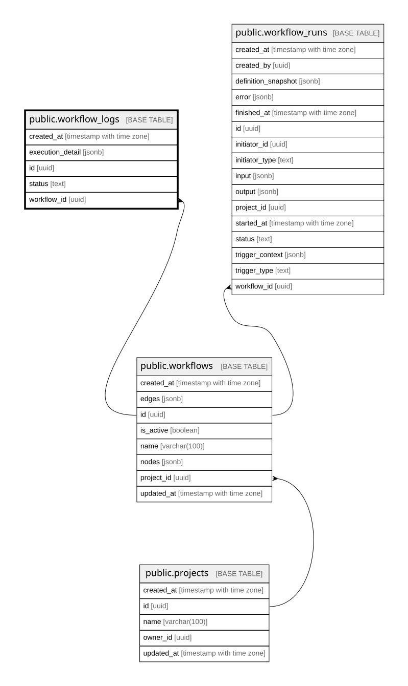

# public.workflow_logs

## Description

워크플로우 실행 성공·실패 이력과 노드 실행 결과

## Columns

| Name             | Type                     | Default           | Nullable | Children | Parents                                 | Comment |
| ---------------- | ------------------------ | ----------------- | -------- | -------- | --------------------------------------- | ------- |
| created_at       | timestamp with time zone | CURRENT_TIMESTAMP | false    |          |                                         |         |
| execution_detail | jsonb                    |                   | false    |          |                                         |         |
| id               | uuid                     | gen_random_uuid() | false    |          |                                         |         |
| status           | text                     |                   | false    |          |                                         |         |
| workflow_id      | uuid                     |                   | false    |          | [public.workflows](public.workflows.md) |         |

## Constraints

| Name                                 | Type        | Definition                                                           |
| ------------------------------------ | ----------- | -------------------------------------------------------------------- |
| workflow_logs_execution_detail_check | CHECK       | CHECK ((jsonb_typeof(execution_detail) = 'array'::text))             |
| workflow_logs_pkey                   | PRIMARY KEY | PRIMARY KEY (id)                                                     |
| workflow_logs_status_check           | CHECK       | CHECK ((status = ANY (ARRAY['SUCCESS'::text, 'FAILED'::text])))      |
| workflow_logs_workflow_id_fkey       | FOREIGN KEY | FOREIGN KEY (workflow_id) REFERENCES workflows(id) ON DELETE CASCADE |

## Indexes

| Name                                  | Definition                                                                                                            |
| ------------------------------------- | --------------------------------------------------------------------------------------------------------------------- |
| workflow_logs_pkey                    | CREATE UNIQUE INDEX workflow_logs_pkey ON public.workflow_logs USING btree (id)                                       |
| workflow_logs_workflow_created_at_idx | CREATE INDEX workflow_logs_workflow_created_at_idx ON public.workflow_logs USING btree (workflow_id, created_at DESC) |

## Relations

---

> Generated by [tbls](https://github.com/k1LoW/tbls)
