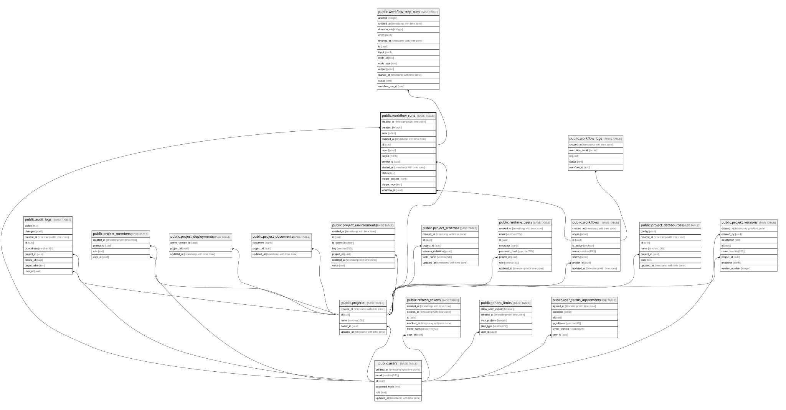

# public.workflow_runs

## Description

워크플로우 실행 단위의 상태·입출력·오류 이력

## Columns

| Name                | Type                     | Default              | Nullable | Children                                                  | Parents                                 | Comment |
| ------------------- | ------------------------ | -------------------- | -------- | --------------------------------------------------------- | --------------------------------------- | ------- |
| created_at          | timestamp with time zone | now()                | false    |                                                           |                                         |         |
| created_by          | uuid                     |                      | true     |                                                           | [public.users](public.users.md)         |         |
| definition_snapshot | jsonb                    |                      | true     |                                                           |                                         |         |
| error               | jsonb                    |                      | true     |                                                           |                                         |         |
| finished_at         | timestamp with time zone |                      | true     |                                                           |                                         |         |
| id                  | uuid                     | gen_random_uuid()    | false    | [public.workflow_step_runs](public.workflow_step_runs.md) |                                         |         |
| initiator_id        | uuid                     |                      | true     |                                                           |                                         |         |
| initiator_type      | text                     | 'BUILDER_USER'::text | false    |                                                           |                                         |         |
| input               | jsonb                    | '{}'::jsonb          | false    |                                                           |                                         |         |
| output              | jsonb                    |                      | true     |                                                           |                                         |         |
| project_id          | uuid                     |                      | false    |                                                           | [public.projects](public.projects.md)   |         |
| started_at          | timestamp with time zone |                      | true     |                                                           |                                         |         |
| status              | text                     | 'PENDING'::text      | false    |                                                           |                                         |         |
| trigger_context     | jsonb                    | '{}'::jsonb          | false    |                                                           |                                         |         |
| trigger_type        | text                     |                      | true     |                                                           |                                         |         |
| workflow_id         | uuid                     |                      | false    |                                                           | [public.workflows](public.workflows.md) |         |

## Constraints

| Name                               | Type        | Definition                                                                                                                                                 |
| ---------------------------------- | ----------- | ---------------------------------------------------------------------------------------------------------------------------------------------------------- |
| workflow_runs_created_by_fk        | FOREIGN KEY | FOREIGN KEY (created_by) REFERENCES users(id) ON DELETE SET NULL                                                                                           |
| workflow_runs_initiator_type_check | CHECK       | CHECK ((initiator_type = ANY (ARRAY['BUILDER_USER'::text, 'RUNTIME_USER'::text, 'SYSTEM'::text])))                                                         |
| workflow_runs_pkey                 | PRIMARY KEY | PRIMARY KEY (id)                                                                                                                                           |
| workflow_runs_project_fk           | FOREIGN KEY | FOREIGN KEY (project_id) REFERENCES projects(id) ON DELETE CASCADE                                                                                         |
| workflow_runs_status_check         | CHECK       | CHECK ((status = ANY (ARRAY['PENDING'::text, 'RUNNING'::text, 'WAITING'::text, 'SUCCEEDED'::text, 'FAILED'::text, 'CANCELLED'::text, 'TIMED_OUT'::text]))) |
| workflow_runs_workflow_fk          | FOREIGN KEY | FOREIGN KEY (workflow_id) REFERENCES workflows(id) ON DELETE CASCADE                                                                                       |

## Indexes

| Name                                        | Definition                                                                                                                              |
| ------------------------------------------- | --------------------------------------------------------------------------------------------------------------------------------------- |
| workflow_runs_initiator_created_at_idx      | CREATE INDEX workflow_runs_initiator_created_at_idx ON public.workflow_runs USING btree (initiator_type, initiator_id, created_at DESC) |
| workflow_runs_pkey                          | CREATE UNIQUE INDEX workflow_runs_pkey ON public.workflow_runs USING btree (id)                                                         |
| workflow_runs_project_created_at_idx        | CREATE INDEX workflow_runs_project_created_at_idx ON public.workflow_runs USING btree (project_id, created_at DESC)                     |
| workflow_runs_project_status_created_at_idx | CREATE INDEX workflow_runs_project_status_created_at_idx ON public.workflow_runs USING btree (project_id, status, created_at DESC)      |
| workflow_runs_workflow_created_at_idx       | CREATE INDEX workflow_runs_workflow_created_at_idx ON public.workflow_runs USING btree (workflow_id, created_at DESC)                   |

## Relations

---

> Generated by [tbls](https://github.com/k1LoW/tbls)
