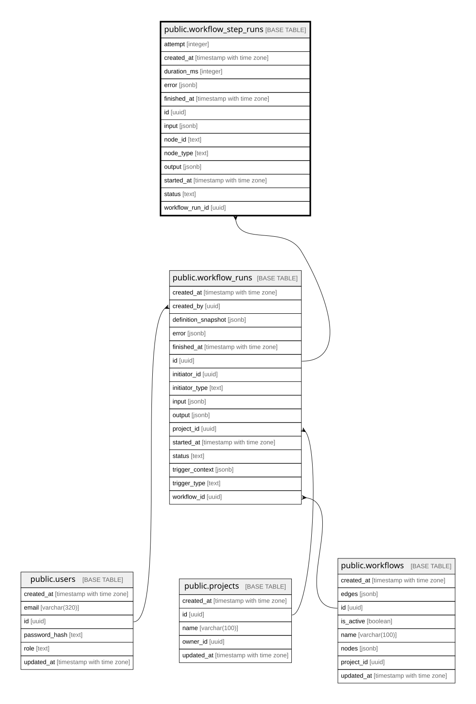

# public.workflow_step_runs

## Description

워크플로우 실행 단계별 상태·재시도·처리 시간 이력

## Columns

| Name            | Type                     | Default           | Nullable | Children | Parents                                         | Comment |
| --------------- | ------------------------ | ----------------- | -------- | -------- | ----------------------------------------------- | ------- |
| attempt         | integer                  | 1                 | false    |          |                                                 |         |
| created_at      | timestamp with time zone | now()             | false    |          |                                                 |         |
| duration_ms     | integer                  |                   | true     |          |                                                 |         |
| error           | jsonb                    |                   | true     |          |                                                 |         |
| finished_at     | timestamp with time zone |                   | true     |          |                                                 |         |
| id              | uuid                     | gen_random_uuid() | false    |          |                                                 |         |
| input           | jsonb                    |                   | true     |          |                                                 |         |
| node_id         | text                     |                   | false    |          |                                                 |         |
| node_type       | text                     |                   | false    |          |                                                 |         |
| output          | jsonb                    |                   | true     |          |                                                 |         |
| started_at      | timestamp with time zone |                   | true     |          |                                                 |         |
| status          | text                     | 'PENDING'::text   | false    |          |                                                 |         |
| workflow_run_id | uuid                     |                   | false    |          | [public.workflow_runs](public.workflow_runs.md) |         |

## Constraints

| Name                                 | Type        | Definition                                                                                                                             |
| ------------------------------------ | ----------- | -------------------------------------------------------------------------------------------------------------------------------------- |
| workflow_step_runs_attempt_check     | CHECK       | CHECK ((attempt >= 1))                                                                                                                 |
| workflow_step_runs_duration_ms_check | CHECK       | CHECK (((duration_ms IS NULL) OR (duration_ms >= 0)))                                                                                  |
| workflow_step_runs_pkey              | PRIMARY KEY | PRIMARY KEY (id)                                                                                                                       |
| workflow_step_runs_run_fk            | FOREIGN KEY | FOREIGN KEY (workflow_run_id) REFERENCES workflow_runs(id) ON DELETE CASCADE                                                           |
| workflow_step_runs_status_check      | CHECK       | CHECK ((status = ANY (ARRAY['PENDING'::text, 'RUNNING'::text, 'SUCCEEDED'::text, 'FAILED'::text, 'SKIPPED'::text, 'RETRYING'::text]))) |

## Indexes

| Name                                    | Definition                                                                                                                        |
| --------------------------------------- | --------------------------------------------------------------------------------------------------------------------------------- |
| workflow_step_runs_pkey                 | CREATE UNIQUE INDEX workflow_step_runs_pkey ON public.workflow_step_runs USING btree (id)                                         |
| workflow_step_runs_run_created_at_idx   | CREATE INDEX workflow_step_runs_run_created_at_idx ON public.workflow_step_runs USING btree (workflow_run_id, created_at)         |
| workflow_step_runs_run_node_attempt_idx | CREATE INDEX workflow_step_runs_run_node_attempt_idx ON public.workflow_step_runs USING btree (workflow_run_id, node_id, attempt) |

## Relations

---

> Generated by [tbls](https://github.com/k1LoW/tbls)
