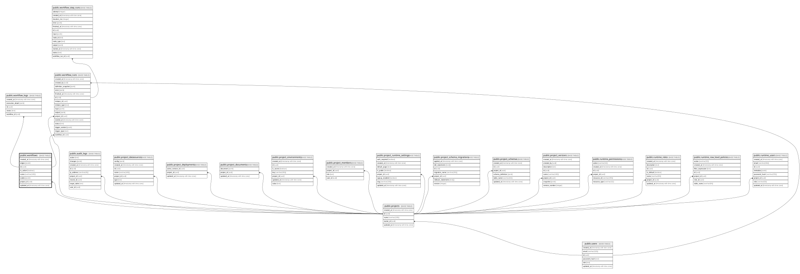

# public.workflows

## Description

프로젝트별 활성 워크플로우 노드 및 엣지 정의

## Columns

| Name       | Type                     | Default           | Nullable | Children                                        | Parents                               | Comment |
| ---------- | ------------------------ | ----------------- | -------- | ----------------------------------------------- | ------------------------------------- | ------- |
| created_at | timestamp with time zone | CURRENT_TIMESTAMP | false    |                                                 |                                       |         |
| edges      | jsonb                    | '[]'::jsonb       | false    |                                                 |                                       |         |
| id         | uuid                     | gen_random_uuid() | false    | [public.workflow_logs](public.workflow_logs.md) |                                       |         |
| is_active  | boolean                  | true              | false    |                                                 |                                       |         |
| name       | varchar(100)             |                   | false    |                                                 |                                       |         |
| nodes      | jsonb                    | '[]'::jsonb       | false    |                                                 |                                       |         |
| project_id | uuid                     |                   | false    |                                                 | [public.projects](public.projects.md) |         |
| updated_at | timestamp with time zone | CURRENT_TIMESTAMP | false    |                                                 |                                       |         |

## Constraints

| Name                       | Type        | Definition                                                         |
| -------------------------- | ----------- | ------------------------------------------------------------------ |
| workflows_edges_check      | CHECK       | CHECK ((jsonb_typeof(edges) = 'array'::text))                      |
| workflows_name_check       | CHECK       | CHECK ((char_length(btrim((name)::text)) > 0))                     |
| workflows_nodes_check      | CHECK       | CHECK ((jsonb_typeof(nodes) = 'array'::text))                      |
| workflows_pkey             | PRIMARY KEY | PRIMARY KEY (id)                                                   |
| workflows_project_id_fkey  | FOREIGN KEY | FOREIGN KEY (project_id) REFERENCES projects(id) ON DELETE CASCADE |
| workflows_project_name_key | UNIQUE      | UNIQUE (project_id, name)                                          |

## Indexes

| Name                                    | Definition                                                                                                                    |
| --------------------------------------- | ----------------------------------------------------------------------------------------------------------------------------- |
| workflows_pkey                          | CREATE UNIQUE INDEX workflows_pkey ON public.workflows USING btree (id)                                                       |
| workflows_project_active_updated_at_idx | CREATE INDEX workflows_project_active_updated_at_idx ON public.workflows USING btree (project_id, is_active, updated_at DESC) |
| workflows_project_name_key              | CREATE UNIQUE INDEX workflows_project_name_key ON public.workflows USING btree (project_id, name)                             |

## Relations

---

> Generated by [tbls](https://github.com/k1LoW/tbls)
